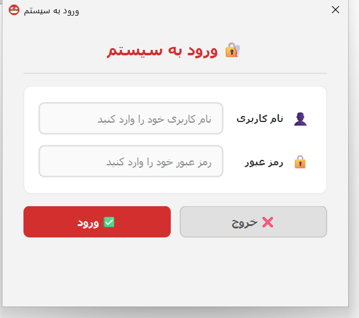
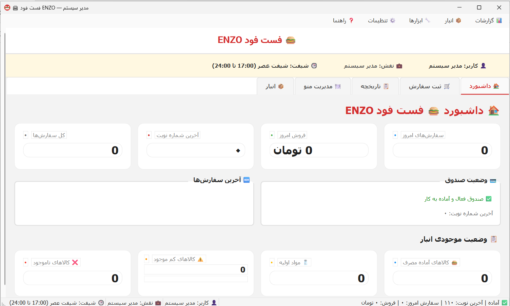
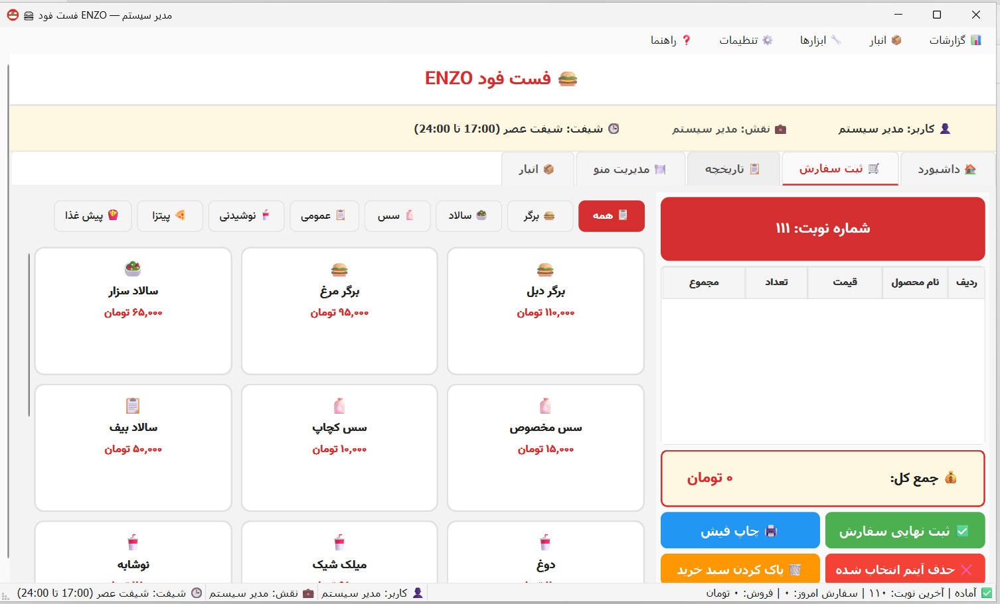
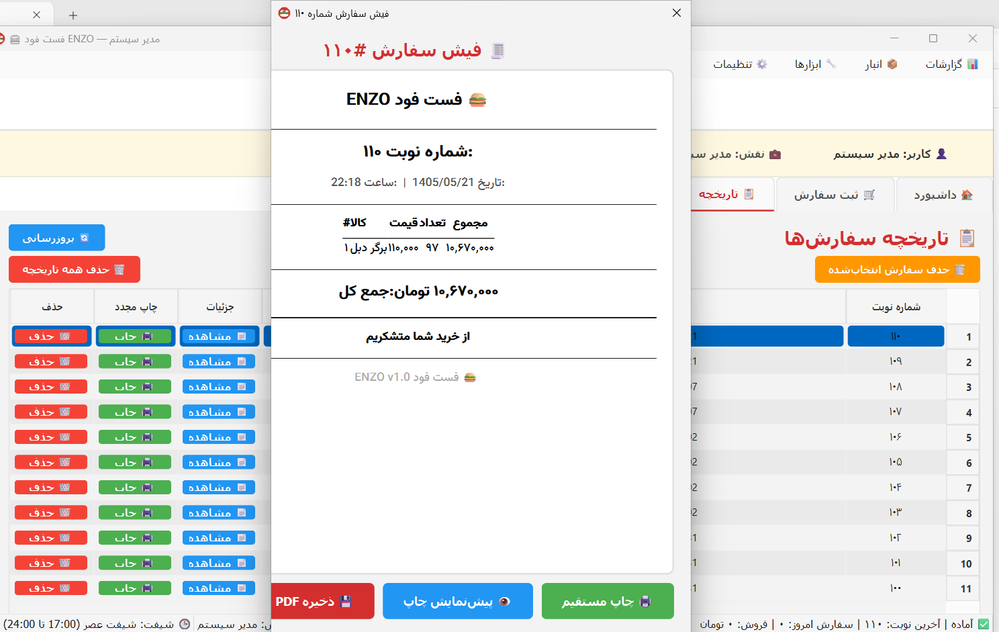
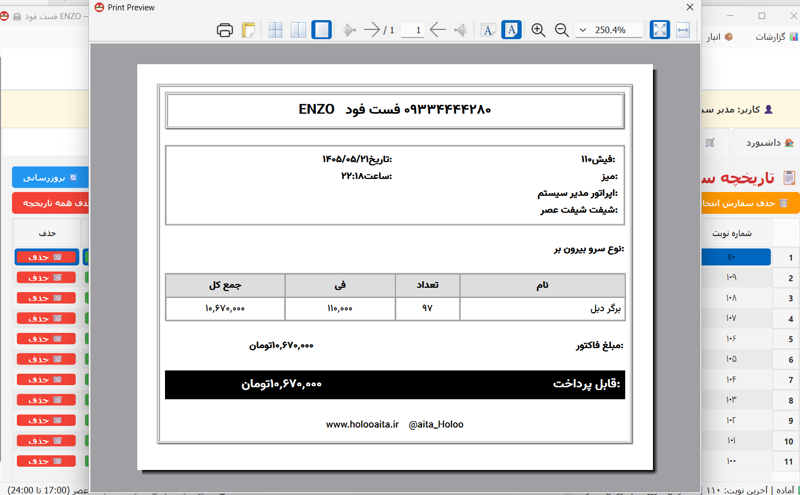

# 🍔 ENZO — سیستم ثبت سفارش و مدیریت فست‌فود

**ENZO** یک نرم‌افزار دسکتاپ برای **ثبت سفارش و مدیریت فست‌فود** است که با Python و PyQt6 توسعه داده شده و برای سیستم‌عامل Windows طراحی شده است.

این سیستم شامل مدیریت سفارش‌ها، محصولات، انبار، کاربران، گزارش‌گیری، چاپ فیش، پایگاه داده SQLite، سیستم سطح دسترسی و صدور فایل اجرایی Windows است.

## 🛠 Technologies

* **Python 3**
* **PyQt6**
* **PyQt6-WebEngine**
* **SQLite**
* **PyInstaller**
* **jdatetime**
* **arabic-reshaper**
* **python-bidi**
* **pywin32**

## ✨ Features

* ثبت و مدیریت سفارش‌ها
* مدیریت محصولات و منو
* مدیریت موجودی و انبار
* مدیریت کاربران
* سیستم ورود و احراز هویت
* کنترل دسترسی مبتنی بر نقش (RBAC)
* گزارش‌های روزانه و ماهانه
* تولید گزارش و فیش به صورت PDF
* چاپ فیش روی پرینتر حرارتی ۸۰ میلی‌متری
* پشتیبانی کامل از زبان فارسی و راست‌به‌چپ
* تقویم شمسی
* سیستم لایسنس
* ساخت نسخه اجرایی `.exe` برای Windows

## 🗄 Database

The application uses **SQLite** for storing:

* Products
* Orders
* Order Items
* Users
* Print records
* Other application data

## 📄 Reports & Printing

Reports are generated using **PyQt6-WebEngine** and Chromium.

The application also supports printing receipts on **80mm thermal printers**.

## 🔐 Security & Access Control

The system includes:

* Role-Based Access Control (RBAC)
* User authentication
* License management
* HMAC-SHA256 license validation
* Hardware-based Machine ID
* Trial period management

## 📦 Installation

Install the required dependencies:

```bash
pip install -r requirements.txt
```

Run the application:

```bash
python main.py
```

## 🏗 Build Windows EXE

To create a Windows executable:

```bash
python build_exe.py
```

The project uses **PyInstaller** for packaging.

## 📁 Project Structure

```text
project/
├── main.py
├── config.py
├── database.py
├── migrations.py
├── permissions.py
├── license_manager.py
├── ui/
├── reports/
├── printer/
├── fonts/
├── backups/
└── build/
```

## 🤖 Development

This project was developed with **Python** and **AI-assisted coding using Zoo Code in Visual Studio Code**.

AI tools were used as development assistance, while the project architecture, features, configuration and implementation were developed and integrated as part of the project.

## 👨‍💻 Project

**ENZO — Fast Food Ordering & Management System**

## 📸 Screenshots










